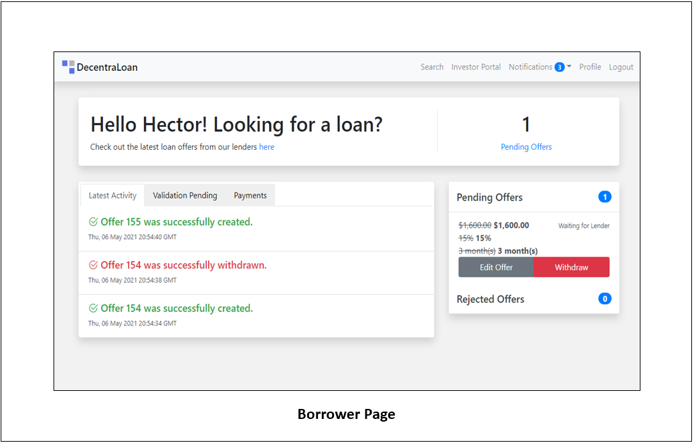
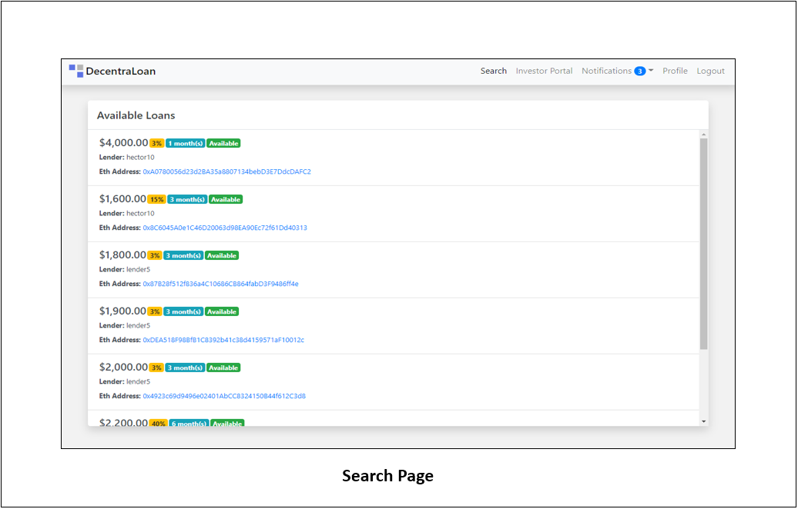
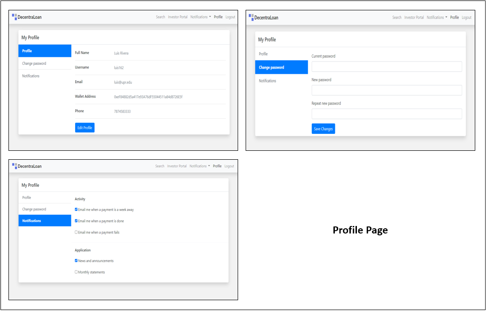

# Decentraloan UI

This project was generated with [Angular CLI](https://github.com/angular/angular-cli) version 11.1.1.

## Development server

Run `ng serve` for a dev server. Navigate to `http://localhost:4200/`. The app will automatically reload if you change any of the source files.

## Code scaffolding

Run `ng generate component component-name` to generate a new component. You can also use `ng generate directive|pipe|service|class|guard|interface|enum|module`.

## Build

Run `ng build` to build the project. The build artifacts will be stored in the `dist/` directory. Use the `--prod` flag for a production build.

## Running unit tests

Run `ng test` to execute the unit tests via [Karma](https://karma-runner.github.io).

## Running end-to-end tests

Run `ng e2e` to execute the end-to-end tests via [Protractor](http://www.protractortest.org/).

## Further help

To get more help on the Angular CLI use `ng help` or go check out the [Angular CLI Overview and Command Reference](https://angular.io/cli) page.

## Description

This repository will focus on the front-end implementation of our project, using angular as our preferred web-application framework.  

## Usage

### Project structure

The front-end project repository is composed of all the angular components with their respective html, css, typescript files based on the angular framework. 

#### Main Components: 

```
Capstone_Project_UI            # Root directory
|- src/app                     # Main Application directory.
|-- active-loans/              # Defines the active-loans page, where users can watch their active loans.
|-- auth/                      # Responsible for user log-in and register.
|-- borrower-page/             # Borrower dashboard component, borrowers will be able to make payments and watch their payment schedules.
|-- create-loan/               # Component called when a lender is trying to create a loan.
|-- entry/                     # Entry component loaded when application booted and no user is logged in.
|-- latest-payments/           # Component responsible for showing all the latest payments made.
|-- lender-page/               # Lender dashboard component, lenders will be able to create loans, review offers and check payments.
|-- loan-detail/               # Component responsible for showing all the loan details from a loan.
|-- loan-search/               # Loan search component, responsible for showing borrowers all the available loans.
|-- make-payment/              # Component responsible for processing payments.
|-- notification/              # Component in charge of showing all user notifications. 
|-- notifications-actionitems/ # add usability
|-- offer/create-offer         # Component for creating offers.
|-- offer/pending-offers       # Pending-offers component, responsible for showing users all pending offers.
|-- payment-schedule/          # Component responsible for preparing the user with dates based on when to pay.
|-- profile/                   # User profile component.
|-- settings/                  # User settings component.
|-- tx-receipt/                # Component responsible of fetching loan receipts.
|-- validate-payment/          # Component responsible for handling payment validation input.
```

## Preliminary Page Images: 









## Credits

### Luis G. Rivera Gonzalez (luis.rivera162@upr.edu) 
### Hector A. Rodriguez  (hector.rodriguez49@upr.edu) 
